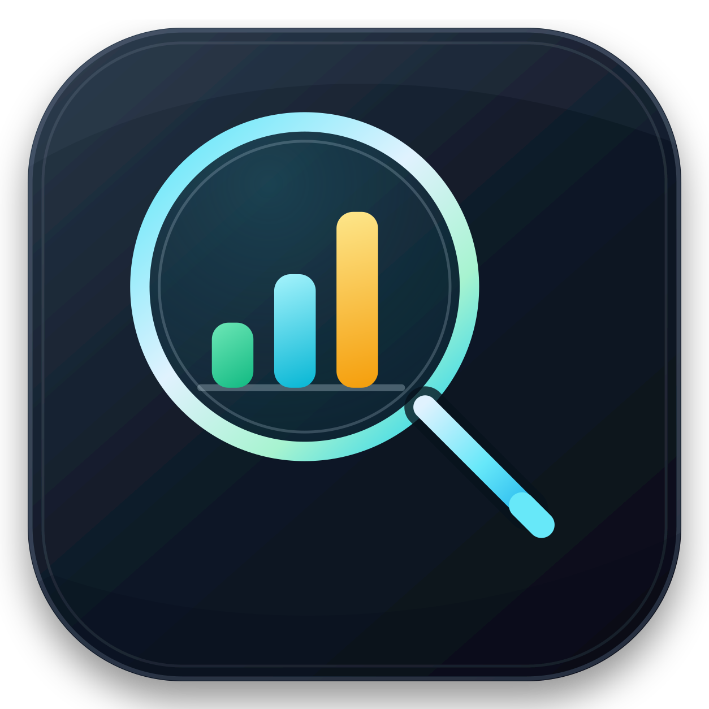

<a href="README.md">English</a> | <a href="README_ZH.md"><strong>中文</strong></a>

# HarnessLens

### AI Coding Harness 的使用效能分析工具

HarnessLens以原始Agent执行事实为输入，分析团队在真实开发中如何使用既有的workflow、Skill、MCP Tool与Agent，识别高成本、低成功率、高人工介入和重复返工等问题，为Harness改进提供直观的数据依据。

  
  
  

## 为什么需要 HarnessLens

团队已经在使用Skill、MCP Tool、项目知识库和开发workflow，但缺少工具可观测性工具去发现团队Harness工程中存在的问题和待优化的地方，比如难以回答：

- 哪些能力真正被团队高频使用，哪些长期闲置？
- 哪些Skill或MCP Tool调用耗时久、消耗Token多、容易失败或反复重试？
- 哪些需求或调用组合的成本明显偏离自身基线？
- 一个需求在需求分析、TD、编码或Code Review等阶段花了多久，经历了多少次尝试和人工补充？
- 出现异常时究竟对应哪些原始session、工具调用和错误证据？
- 改动Skill、MCP Tool、项目知识库或workflow后，实际使用数据是否改善？

## 分析对象

| 对象        | HarnessLens关注的问题                                                                                                 |
| ----------- | --------------------------------------------------------------------------------------------------------------------- |
| Skill       | 调用频率、耗时、状态、重试次数和版本差异如何？                                                                        |
| MCP Tool    | 调用量、耗时、失败次数、输出大小和上下文成本是否异常？                                                                |
| LLM模型     | 不同LLM模型下，能力使用模式是否存在差异？切换模型后是否出现功能退化？                                                 |
| Workflow    | 开发流程在哪些环节出现高成本、失败或反复执行？需求分析、TD、编码和Code Review节点的耗时、尝试次数和人工补充信息如何？ |
| Harness版本 | Skill、MCP、知识库或workflow更新后，相关指标是否出现可验证变化？                                                      |

## 本机 Coding Agent 数据基础层

HarnessLens 内置 [`coding-agent-data`](./crates/coding-agent-data)：一个面向桌面
应用、CLI、分析工具、历史查看器及其他本机 Coding Agent 数据消费者的只读 Rust
数据访问库。开发者可以用它构建本机数据浏览、索引、同步、分析和可视化功能，
无需分别适配每个 Agent 的私有数据目录、存储格式和 schema。

应用可以通过一套统一 API 使用不同 Coding Agent 的数据。该库提供数据源发现、
读取与解析、统一 record/change 模型、基于 checkpoint 的增量同步，以及实时
数据变更监听。当前实现支持 Codex 的 thread 元数据，以及活跃、归档和压缩的
rollout 事件；后续可以在不向消费者暴露私有存储契约的前提下扩展其他 Provider
和数据类型。

详见 [crate 说明](./crates/coding-agent-data/README.md)和
[架构设计](./docs/coding-agent-data.md)。

让AI Coding Harness的改进变得可观测和可衡量。

