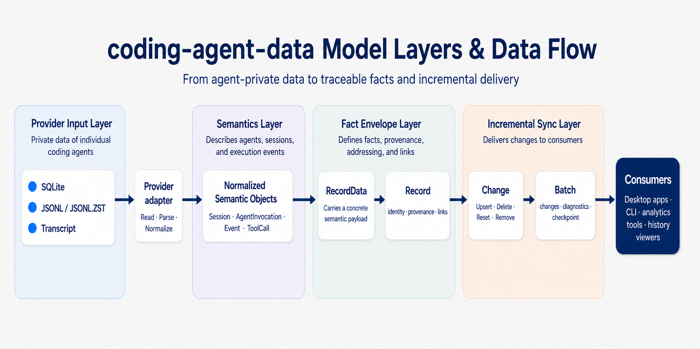

<div align="center">

<p><a href="GLOSSARY.md"><strong>English</strong></a> | <a href="GLOSSARY_ZH.md">中文</a></p>

</div>

# Glossary

This glossary explains the core `coding-agent-data` models, their boundaries,
typical relationships, and the main sources that influenced their names.

## Model layers and responsibility boundaries

The layers below are conceptual categories used to explain model responsibility.
They are not Rust module layers, database table layers, or inheritance
relationships. A type may appear as a field or enum payload of another type
without belonging to the same layer.

| Layer            | Question it answers                                                              | Main types                                                                                                  | Responsibility and boundary                                                                                                            |
| ---------------- | -------------------------------------------------------------------------------- | ----------------------------------------------------------------------------------------------------------- | -------------------------------------------------------------------------------------------------------------------------------------- |
| Provider input   | Where is the source data, and how does a provider read it?                       | Codex, Claude Code, and provider implementations                                                            | Reads provider-private SQLite, JSONL, and transcript formats. This is the input boundary, not the shared business model.               |
| Semantic model   | What are the Agent, Session, and execution doing?                                | `Session`, `AgentInvocation`, `ModelInvocation`, `Event`, `Message`, `ToolCall`, `TaskArtifact`, and others | Describes provider-neutral objects and behavior, such as an Agent execution, a message, or a tool call.                                |
| Fact envelope    | Where did a normalized fact come from, and how can it be identified and related? | `Record`, `RecordData`                                                                                      | Supplies stable identity, source, original location, relationships, and the semantic payload. It does not add new Agent behavior.      |
| Incremental sync | How are additions, changes, and removals delivered to consumers?                 | `Change`, `Batch`, `Checkpoint`                                                                             | Describes scan results and synchronization, including upserts, deletes, rebuilds, and continuation. It is not an Agent behavior model. |

The relationship between the layers can be summarized as:



## Core model quick reference

| Name                  | Layer            | Definition and responsibility                                                                                                                                                                                                              | Typical relationship or example                                                                                                              |
| --------------------- | ---------------- | ------------------------------------------------------------------------------------------------------------------------------------------------------------------------------------------------------------------------------------------ | -------------------------------------------------------------------------------------------------------------------------------------------- |
| [`Session`](src/model.rs#L378) | Semantic         | A provider-persisted conversation, thread, or work context. It is the durable container shared by multiple Agent executions and commonly carries title, working directory, model, Git, and token metadata.                                 | One Codex Thread can map to one `Session` containing several `AgentInvocation` values.                                                       |
| [`AgentInvocation`](src/model.rs#L1681) | Semantic         | One complete Agent processing cycle after receiving input. It may include model requests, tool operations, message handling, and child-Agent collaboration until it reaches a lifecycle state.                                             | “Search the code, edit the file, run tests, and reply” can be one `AgentInvocation` containing several `ModelInvocation` and `Event` values. |
| [`ModelInvocation`](src/model.rs#L1365) | Semantic         | One concrete request from an Agent to a language model and its lifecycle. It is a sub-process of an Agent execution and can carry model, status, stop reason, and latency data.                                                            | One `AgentInvocation` may contain multiple `ModelInvocation` values when tools or iterative decisions trigger more model requests.           |
| [`Event`](src/model.rs#L2019) | Semantic         | One ordered fact observed during execution. It carries sequence, actor, causal links, and `EventData`, allowing messages, reasoning, tool activity, file changes, and child-Agent activity to be represented.                              | “The user asked a question”, “the Agent called search”, and “the tool returned” can be separate Events in one invocation.                    |
| [`EventData`](src/model.rs#L1957) | Semantic         | The typed payload that says what an Event represents. Variants include `Message`, `ToolCall`, `ToolResult`, `FileChange`, `AgentInvocation`, and `Plan`.                                                                                   | `Event { actor: Actor::Tool, data: EventData::ToolResult(...) }` represents a tool result.                                                   |
| [`UsageReport`](src/model.rs#L549) | Semantic         | A usage fact reported by a Provider at a point in time. It may include model and request identity, cumulative token snapshots, token deltas, service tier, and cost. It describes accounting, not an Agent execution.                      | `RecordData::UsageReport(UsageReport)` can replace a cumulative session value or aggregate a `delta` when attribution is sound.                    |
| [`Actor`](src/model.rs#L695) | Semantic         | The person, Agent, tool, runtime, or system that caused or produced an Event. It describes event origin, not the message role in a conversation protocol.                                                                                  | A tool result can use `actor: Actor::Tool`.                                                                                                  |
| [`MessageRole`](src/model.rs#L772) | Semantic         | The role a `Message` plays in the conversation protocol, such as `System`, `Developer`, `User`, `Assistant`, or `Tool`. It does not by itself prove which subject performed an action.                                                     | A message may use `MessageRole::Assistant` while its enclosing Event uses `Actor::Agent`.                                                    |
| [`Message`](src/model.rs#L1033) | Semantic         | A conversation message with a role, optional presentation phase, and ordered content blocks. Event sequence, actor, and causal links remain on the enclosing `Event`.                                                                      | A user prompt, intermediate commentary, or final answer can be normalized as a `Message`.                                                    |
| [`MessagePhase`](src/model.rs#L802) | Semantic         | The presentation phase of an assistant message. `Commentary` is intermediate output, `FinalAnswer` completes the current request, and `Other` preserves an unmapped provider value.                                                        | `Message { role: Assistant, phase: FinalAnswer, ... }` describes a final answer, not necessarily a successful invocation.                    |
| [`SessionRelationKind`](src/model.rs#L248) | Semantic         | The lineage relationship between the current `Session` and another session. `Fork` branches history, `Child` represents a child session created by an Agent, and `Continuation` moves the same logical work into a new provider container. | `S2 --Fork--> S1` means that S2 branched from S1.                                                                                            |
| [`HistoryMode`](src/model.rs#L295) | Semantic         | How a Provider stores and assembles Session history. `Legacy` is typically self-contained, `Paginated` uses logical ordinals and may reference an ancestor prefix, and `Other` preserves an unknown mode.                                  | A forked Session can read an ancestor prefix in `Paginated` mode and then append its own records.                                            |
| [`InputQueueMutation`](src/model.rs#L1862) | Semantic         | One operation applied to the pending user-input queue, such as enqueue, dequeue, remove, or clear. It describes a queue change, not a queue snapshot.                                                                                      | `EventData::InputQueue(InputQueueMutation { operation: QueueOperation::Enqueue, ... })` records an input being queued.                       |
| [`TaskArtifact`](src/model.rs#L1649) | Semantic         | A deliverable produced by an Agent or child Agent and returned to an outside consumer. It may contain text, file references, structured data, or other `ContentBlock` values.                                                              | A review report, patch explanation, JSON document, or image reference can be a `TaskArtifact`.                                               |
| [`Record`](src/model.rs#L2105) | Fact envelope    | A normalized fact envelope with stable ID, Provider source, original location, Session/Invocation links, and semantic payload. It lets consumers locate, update, delete, and trace a fact.                                                 | `Record { id, source, origin, data: RecordData::Event(...) }` is a sourced event fact that can be synchronized incrementally.                |
| [`RecordData`](src/model.rs#L2073) | Fact envelope    | The concrete fact carried by a `Record`. It wraps semantic objects such as `Session`, `AgentInvocation`, `Event`, `UsageReport`, `RateLimit`, and `Unknown` in one tagged enum.                                                            | `RecordData::Event(Event)` says what the fact means while the surrounding `Record` supplies identity and provenance.                         |
| [`Change`](src/model.rs#L2150) | Incremental sync | One mutation a Provider asks a consumer to apply to normalized facts. `Upsert` inserts or replaces, `Delete` removes, `Reset` rebuilds an artifact, and `Remove` cleans up a vanished artifact.                                            | After receiving `Change::Upsert(record)`, a consumer writes or replaces the fact by `record.id`.                                             |
| [`Batch`](src/model.rs#L2299) | Incremental sync | One bounded page returned by `scan`. It contains ordered `Change` values, recoverable diagnostics, a continuation `Checkpoint`, and `has_more`.                                                                                            | Apply a Batch and save its Checkpoint in the same transaction before deciding whether to scan again.                                         |
| [`Checkpoint`](src/model.rs#L2225) | Incremental sync | Provider-private continuation state for an incremental scan. Consumers persist it and pass it back unchanged rather than interpreting its internal state.                                                                                  | Codex and Claude Code can use different checkpoint formats behind the same `Checkpoint` interface.                                           |

## Worked example

Suppose a user asks a Codex thread to “fix the login timeout and run the tests”:

| Order | Model           | Example                                     | Meaning                              |
| ----- | --------------- | ------------------------------------------- | ------------------------------------ |
| 1     | Session         | S1: fix the login timeout and run the tests | Durable context for the work thread  |
| 2     | AgentInvocation | I1: handle this request                     | One complete Agent execution         |
| 3     | Event           | E1: user message                            | One fact inside I1                   |
| 4     | Event           | E2: search tool call                        | `EventData::ToolCall`                |
| 5     | Event           | E3: search result                           | `EventData::ToolResult`              |
| 6     | Event           | E4: update `auth_client.rs`                 | `EventData::FileChange`              |
| 7     | Event           | E5: test tool call                          | `EventData::ToolCall`                |
| 8     | Event           | E6: test result                             | `EventData::ToolResult`              |
| 9     | Event           | E7: final response                          | Usually `EventData::Message`         |
| 10    | AgentInvocation | I2: a later user follow-up                  | Can belong to the same Session as I1 |

The logical relationship is:

```text
Session S1
├── AgentInvocation I1
│   ├── Event E1
│   ├── Event E2
│   └── ...
└── AgentInvocation I2
```

In code, these objects are not nested into one large structure. A Provider
adapter emits one flat `Record` for each fact that can be independently
identified, updated, or deleted. `Record` is the fact envelope, carrying stable
identity, source, relationships, and provenance, while `RecordData` carries the
semantic payload. Records relate to one another through IDs such as `session`,
`invocation`, and `parent`, rather than copying or embedding complete objects.

This shape lets a consumer upsert or delete one fact by Record ID without
rewriting the entire Session. It also avoids repeated nested data and circular
references, keeping semantic content separate from source attribution.

The following array shows S1, I1, and E1–E7 as independent Records. Optional
fields are omitted:

```json
[
    {
        "id": "codex-local:session:thread-123",
        "source": "codex-local",
        "session": null,
        "invocation": null,
        "origin": {
            "source": "codex-local",
            "path": "/data/codex/state.sqlite",
            "location": { "kind": "database_record", "key": "thread-123" }
        },
        "data": {
            "type": "session",
            "value": {
                "external_id": "thread-123",
                "title": "Fix the login timeout and run the tests",
                "cwd": "/workspace/app",
                "archived": false,
                "model": "gpt-5",
                "git_branch": "main",
                "quality": "partial"
            }
        }
    },
    {
        "id": "codex-local:invocation:turn-001",
        "source": "codex-local",
        "session": "codex-local:session:thread-123",
        "invocation": null,
        "origin": {
            "source": "codex-local",
            "path": "/data/codex/rollout.jsonl",
            "location": { "kind": "json_line", "line": 42 }
        },
        "data": {
            "type": "agent_invocation",
            "value": {
                "invocation_id": "turn-001",
                "operation": "invoke",
                "status": "completed"
            }
        }
    },
    {
        "id": "codex-local:event:turn-001:1",
        "source": "codex-local",
        "session": "codex-local:session:thread-123",
        "invocation": "codex-local:invocation:turn-001",
        "origin": {
            "source": "codex-local",
            "path": "/data/codex/rollout.jsonl",
            "location": { "kind": "json_line", "line": 43 }
        },
        "data": {
            "type": "event",
            "value": {
                "sequence": { "position": 1, "part": 0 },
                "parent": null,
                "actor": "user",
                "data": {
                    "type": "message",
                    "value": {
                        "role": "user",
                        "phase": null,
                        "content": [{ "type": "text", "text": "Fix the login timeout and run the tests" }]
                    }
                }
            }
        }
    },
    {
        "id": "codex-local:event:turn-001:2",
        "source": "codex-local",
        "session": "codex-local:session:thread-123",
        "invocation": "codex-local:invocation:turn-001",
        "origin": {
            "source": "codex-local",
            "path": "/data/codex/rollout.jsonl",
            "location": { "kind": "json_line", "line": 44 }
        },
        "data": {
            "type": "event",
            "value": {
                "sequence": { "position": 2, "part": 0 },
                "parent": "codex-local:event:turn-001:1",
                "actor": "agent",
                "data": {
                    "type": "tool_call",
                    "value": {
                        "call_id": "search-001",
                        "name": "search",
                        "namespace": null,
                        "title": "Search for login timeout code",
                        "kind": "search",
                        "status": "completed",
                        "input": { "query": "login timeout", "path": "." },
                        "locations": []
                    }
                }
            }
        }
    },
    {
        "id": "codex-local:event:turn-001:3",
        "source": "codex-local",
        "session": "codex-local:session:thread-123",
        "invocation": "codex-local:invocation:turn-001",
        "origin": {
            "source": "codex-local",
            "path": "/data/codex/rollout.jsonl",
            "location": { "kind": "json_line", "line": 45 }
        },
        "data": {
            "type": "event",
            "value": {
                "sequence": { "position": 3, "part": 0 },
                "parent": "codex-local:event:turn-001:2",
                "actor": "tool",
                "data": {
                    "type": "tool_result",
                    "value": {
                        "call_id": "search-001",
                        "name": "search",
                        "output": { "matches": ["src/auth_client.rs:42"] },
                        "content": [{ "type": "text", "text": "Found src/auth_client.rs:42" }],
                        "status": "completed",
                        "error": null,
                        "duration_ms": 120
                    }
                }
            }
        }
    },
    {
        "id": "codex-local:event:turn-001:4",
        "source": "codex-local",
        "session": "codex-local:session:thread-123",
        "invocation": "codex-local:invocation:turn-001",
        "origin": {
            "source": "codex-local",
            "path": "/data/codex/rollout.jsonl",
            "location": { "kind": "json_line", "line": 46 }
        },
        "data": {
            "type": "event",
            "value": {
                "sequence": { "position": 4, "part": 0 },
                "parent": "codex-local:event:turn-001:3",
                "actor": "agent",
                "data": {
                    "type": "file_change",
                    "value": {
                        "path": "src/auth_client.rs",
                        "old_path": null,
                        "kind": "update",
                        "diff": "- timeout = 5s\\n+ timeout = 30s",
                        "status": "completed"
                    }
                }
            }
        }
    },
    {
        "id": "codex-local:event:turn-001:5",
        "source": "codex-local",
        "session": "codex-local:session:thread-123",
        "invocation": "codex-local:invocation:turn-001",
        "origin": {
            "source": "codex-local",
            "path": "/data/codex/rollout.jsonl",
            "location": { "kind": "json_line", "line": 47 }
        },
        "data": {
            "type": "event",
            "value": {
                "sequence": { "position": 5, "part": 0 },
                "parent": "codex-local:event:turn-001:4",
                "actor": "agent",
                "data": {
                    "type": "tool_call",
                    "value": {
                        "call_id": "test-001",
                        "name": "shell",
                        "namespace": null,
                        "title": "Run tests",
                        "kind": "execute",
                        "status": "completed",
                        "input": { "command": "cargo test" },
                        "locations": []
                    }
                }
            }
        }
    },
    {
        "id": "codex-local:event:turn-001:6",
        "source": "codex-local",
        "session": "codex-local:session:thread-123",
        "invocation": "codex-local:invocation:turn-001",
        "origin": {
            "source": "codex-local",
            "path": "/data/codex/rollout.jsonl",
            "location": { "kind": "json_line", "line": 48 }
        },
        "data": {
            "type": "event",
            "value": {
                "sequence": { "position": 6, "part": 0 },
                "parent": "codex-local:event:turn-001:5",
                "actor": "tool",
                "data": {
                    "type": "tool_result",
                    "value": {
                        "call_id": "test-001",
                        "name": "shell",
                        "output": { "exit_code": 0 },
                        "content": [{ "type": "text", "text": "Tests passed" }],
                        "status": "completed",
                        "error": null,
                        "duration_ms": 8400
                    }
                }
            }
        }
    },
    {
        "id": "codex-local:event:turn-001:7",
        "source": "codex-local",
        "session": "codex-local:session:thread-123",
        "invocation": "codex-local:invocation:turn-001",
        "origin": {
            "source": "codex-local",
            "path": "/data/codex/rollout.jsonl",
            "location": { "kind": "json_line", "line": 49 }
        },
        "data": {
            "type": "event",
            "value": {
                "sequence": { "position": 7, "part": 0 },
                "parent": "codex-local:event:turn-001:6",
                "actor": "agent",
                "data": {
                    "type": "message",
                    "value": {
                        "role": "assistant",
                        "phase": "final_answer",
                        "content": [{ "type": "text", "text": "The login timeout is fixed, and cargo test passes." }]
                    }
                }
            }
        }
    }
]
```

`RecordData` always serializes as an object with `type` and `value`. A complete
`Record` may also include `timestamp`, `origin`, and `original` fields.

## Semantic model

### Session

| Item             | Description                                                                                                 |
| ---------------- | ----------------------------------------------------------------------------------------------------------- |
| Rust type        | [Session](src/model.rs#L378)                                                                                |
| Definition       | A provider-persisted conversation, thread, work task, or transcript context.                                |
| Main fields      | `external_id`, `title`, `cwd`, `transcript`, timestamps, model, token snapshot, Git metadata, archive state |
| Can contain      | Multiple `AgentInvocation` values and the Events they produce                                               |
| Typical example  | Three questions in one Codex Thread, with all three invocations sharing one Session                         |
| Does not contain | One execution, one model request, one directory, or one raw database row                                    |

Reference sources:

- [Google ADK: Session — Tracking individual conversations](https://adk.dev/sessions/session/)
- [Agent Client Protocol: Session Setup](https://agentclientprotocol.com/protocol/v1/session-setup)

### SessionRelationKind, SessionRelation, and HistoryMode

| Term                  | Question it answers                                | Meaning                                                                                                                                                           | Example                                                         |
| --------------------- | -------------------------------------------------- | ----------------------------------------------------------------------------------------------------------------------------------------------------------------- | --------------------------------------------------------------- |
| `SessionRelationKind` | How are two Sessions related?                      | `Fork` branches existing history, `Child` is created by an Agent in a parent Session, and `Continuation` moves the same logical work to a new Provider container. | `S2 -> Fork -> S1`                                              |
| `SessionRelation`     | Which two Sessions does this edge connect?         | A directed lineage edge containing a `kind` and the target `session`.                                                                                             | `Session S2` has `Fork(S1)`.                                    |
| `HistoryMode`         | How does a Provider store and assemble history?    | `Legacy` is self-contained transcript history, `Paginated` uses logical ordinals and may reference an ancestor prefix, and `Other` preserves an unknown mode.     | S2 reads S1’s prefix, then its own records.                     |
| `SessionHistory`      | Which physical ranges make up one logical Session? | Stores the history mode, ancestor baseline, own starting ordinal, and lineage segments.                                                                           | S1’s first 100 records plus S2 records starting at ordinal 100. |

The direction is always “current Session → referenced Session”:

```text
S2 --Fork--------> S1   S2 branched from S1
S3 --Child-------> S1   S3 is a child Session created from S1
S4 --Continuation-> S1   S4 continues S1's logical work
```

Reference sources:

- [OpenAI Codex: Thread lineage fields](https://github.com/openai/codex/blob/main/codex-rs/app-server-protocol/src/protocol/v2/thread.rs)
- [OpenAI Codex: ThreadHistoryMode](https://github.com/openai/codex/blob/main/codex-rs/app-server-protocol/src/protocol/v2/thread_data.rs)

### AgentInvocation

| Item                | Description                                                                                                                                                                                    |
| ------------------- | ---------------------------------------------------------------------------------------------------------------------------------------------------------------------------------------------- |
| Rust type           | [AgentInvocation](src/model.rs#L1681)                                                                                                                                                          |
| Definition          | The complete Agent-side process after receiving input, including model requests, tool operations, message handling, and possible child-Agent collaboration until a lifecycle state is reached. |
| Can contain         | Multiple `ModelInvocation`, `ToolCall`, `ToolResult`, `Message`, `FileChange`, and `TaskArtifact` values                                                                                       |
| Top-level payload   | `RecordData::AgentInvocation`                                                                                                                                                                  |
| Child-Agent payload | `EventData::AgentInvocation`                                                                                                                                                                   |
| Typical example     | Search the code, edit a file, run tests, and return the result                                                                                                                                 |
| Does not contain    | A Session, one model request, one tool call, or one Event                                                                                                                                      |

Comparable names in other systems:

| System or protocol   | Name       | Relationship to this model                                                                                     |
| -------------------- | ---------- | -------------------------------------------------------------------------------------------------------------- |
| Google ADK           | Invocation | A complete request-processing flow that can include Agent runs, model calls, tools, and callbacks              |
| Codex                | Turn       | A provider-native execution unit. Fields such as `turn_id` remain provider data.                               |
| Other Agent runtimes | Run        | A common label, although boundaries vary by runtime                                                            |
| A2A                  | Task       | A stateful Agent work unit with a lifecycle. Similar in meaning, but not an object from this crate’s protocol. |

`AgentInvocation` is used here to make the Agent-level boundary explicit and to
distinguish it from `ModelInvocation` and `ToolCall`.

Reference sources:

- [Google ADK: Runtime Event Loop — Invocation](https://adk.dev/runtime/event-loop/#invocation)
- [OpenAI Codex: Turn protocol](https://github.com/openai/codex/blob/main/codex-rs/app-server-protocol/src/protocol/v2/turn.rs)
- [A2A: Key Concepts — Task](https://a2a-protocol.org/latest/topics/key-concepts/#task)
- [A2A: Life of a Task](https://a2a-protocol.org/latest/topics/life-of-a-task/)

### Event and EventData

| Item      | Event                                                                      | EventData                                                                                   |
| --------- | -------------------------------------------------------------------------- | ------------------------------------------------------------------------------------------- |
| Rust type | [Event](src/model.rs#L2019)                                                | [EventData](src/model.rs#L1957)                                                             |
| Role      | Event envelope                                                             | Event payload                                                                               |
| Carries   | `external_id`, `sequence`, `parent`, `inherited_from`, `actor`, `agent_id` | `Message`, `Reasoning`, `ToolCall`, `ToolResult`, `FileChange`, `AgentInvocation`, and more |
| Answers   | When did it happen, who produced it, and what is it related to?            | What specifically happened?                                                                 |

Common `EventData` variants:

| Variant                          | Meaning                                   | Example                                 |
| -------------------------------- | ----------------------------------------- | --------------------------------------- |
| `Message`                        | Conversation message                      | User prompt or final Agent answer       |
| `Reasoning`                      | Reasoning summary exposed by the Provider | Visible Agent reasoning summary         |
| `ToolCall`                       | Tool request or start                     | Ask the shell to run a command          |
| `ToolResult`                     | Tool result                               | Command output or search result         |
| `FileChange`                     | File-system change                        | Create, update, delete, or move a file  |
| `ModelInvocation`                | One language-model request                | One request sent to an LLM              |
| `AgentInvocation`                | Child or collaborating Agent execution    | Delegate a code review                  |
| `Plan`                           | Agent plan and its steps                  | Pending steps and completion state      |
| `ContextCompaction`              | Context compaction                        | Transcript replaced by a summary        |
| `InputQueue(InputQueueMutation)` | Pending-input queue mutation              | Enqueue, dequeue, or remove input       |
| `Unknown`                        | Provider event not normalized yet         | Preserve its type name and unknown data |

Typical shape:

```text
Event
├── sequence: EventSequence
├── actor: Actor
└── data: EventData::ToolCall
```

Reference sources:

- [Google ADK: Events](https://adk.dev/events/)
- [Google ADK: Runtime Event Loop](https://adk.dev/runtime/event-loop/)

### UsageReport, TokenUsage, Cost, and RateLimit

| Term          | Definition                                                                                                                            | Main fields                                          |
| ------------- | ------------------------------------------------------------------------------------------------------------------------------------- | ---------------------------------------------------- |
| `UsageReport` | A usage fact reported by a Provider at a point in time. It can carry model and request identity, cumulative values, deltas, and cost. | model, request ID, `cumulative`, `delta`, cost       |
| `TokenUsage`  | A group of independently countable token totals, used for a cumulative snapshot or the delta in one report.                           | input, cached input, output, reasoning output, total |
| `Cost`        | Provider-reported amount and currency. The amount is stored as text to avoid binary floating-point error.                             | amount, currency                                     |
| `RateLimit`   | A point-in-time snapshot of provider limit windows, credits, spend, and trigger reason.                                               | windows, credits, spend limit, reached reason        |

`UsageReport` is the outer report and `TokenUsage` contains its counters. One
Record can carry a model name, request ID, cumulative tokens, token delta, and
cost together. Consumers replace cumulative values. They aggregate `delta`
only when attribution rules establish that summing is valid.

Reference sources:

- [Anthropic Messages API: usage fields](https://platform.claude.com/docs/en/api/messages)
- [OpenAI Codex: thread token usage model](https://github.com/openai/codex/blob/main/codex-rs/protocol/src/models.rs)

### Actor, MessageRole, Message, and MessagePhase

These terms live at different levels. The key distinction is that `Actor` says
who or what produced an Event, while `MessageRole` says how a Message functions
in the conversation protocol.

| Type            | Question it answers                                    | What it describes                                                                | Example                                                                               |
| --------------- | ------------------------------------------------------ | -------------------------------------------------------------------------------- | ------------------------------------------------------------------------------------- |
| `Actor`         | Who or what caused this Event?                         | The Event envelope’s origin: `User`, `Agent`, `System`, `Environment`, or `Tool` | A tool result uses `Actor::Tool`.                                                     |
| `MessageRole`   | What role does this Message play in the conversation?  | The Message payload role: `System`, `Developer`, `User`, `Assistant`, or `Tool`  | A tool result encoded as a message may use `Tool` or retain a provider-specific role. |
| `Message`       | What does this conversation message contain?           | `role`, optional `phase`, and ordered `ContentBlock` values                      | User prompt, Agent commentary, or final answer                                        |
| `MessagePhase`  | Which presentation phase is this assistant message in? | `Commentary`, `FinalAnswer`, or an unknown provider value                        | `role = Assistant, phase = FinalAnswer`                                               |
| `EventSequence` | How are Events ordered within one source?              | Provider/artifact position, derived-part order, and optional logical ordinal     | Use `part` when one source row yields several Events.                                 |

Normalized tool-result example:

```text
Event
├── actor: Actor::Tool
└── data: EventData::Message(
        Message {
            role: MessageRole::Tool,
            phase: None,
            content: [Text("test command output")]
        }
    )
```

Normalized final-answer example:

```text
Event
├── actor: Actor::Agent
└── data: EventData::Message(
        Message {
            role: MessageRole::Assistant,
            phase: Some(MessagePhase::FinalAnswer),
            content: [Text("The login timeout is fixed, and the tests pass")]
        }
    )
```

Field boundaries:

| Type           | Main field           | Normalization rule                                                                                     |
| -------------- | -------------------- | ------------------------------------------------------------------------------------------------------ |
| `Actor`        | `Event.actor`        | Identifies the producer observed for the Event. Use `Other` when the Provider has no normalized value. |
| `MessageRole`  | `Message.role`       | Identifies the conversation role. It cannot prove that the Agent performed an action.                  |
| `Message`      | role, phase, content | Carries message content only. Sequence, actor, and parent remain on `Event`.                           |
| `MessagePhase` | `Message.phase`      | `None` means the Provider did not report a phase. It is not synonymous with `FinalAnswer`.             |

Reference sources:

- [Google ADK: Identifying event origin and type](https://adk.dev/events/#identifying-event-origin-and-type)
- [Anthropic: Messages API](https://platform.claude.com/docs/en/api/messages)
- [Google ADK: Events](https://adk.dev/events/)
- [OpenAI Codex: MessagePhase](https://github.com/openai/codex/blob/main/codex-rs/protocol/src/models.rs)

### TaskArtifact

| Item             | Description                                                                        |
| ---------------- | ---------------------------------------------------------------------------------- |
| Rust type        | [TaskArtifact](src/model.rs#L1649)                                                 |
| Definition       | A deliverable produced and returned by an Agent or child Agent during a task       |
| Main fields      | artifact ID, name, description, parts, metadata                                    |
| `parts`          | Ordered `ContentBlock` values, including text, file references, or structured data |
| Typical examples | Code review report, patch explanation, structured JSON, image, or file reference   |
| Does not include | The workspace file change itself, and it does not have to be a file                |

Difference from `FileChange`:

| Model          | Represents                                         | Example                         |
| -------------- | -------------------------------------------------- | ------------------------------- |
| `FileChange`   | A file-system operation performed in the workspace | Update `auth_client.rs`         |
| `TaskArtifact` | A deliverable returned to the outside consumer     | Return a security review report |

Reference sources:

- [A2A: Key Concepts — Artifact](https://a2a-protocol.org/latest/topics/key-concepts/#artifacts)
- [A2A: Life of a Task](https://a2a-protocol.org/latest/topics/life-of-a-task/)

## Fact envelope layer

### Record and RecordData

| Item      | `Record`                                                                          | `RecordData`                                                     |
| --------- | --------------------------------------------------------------------------------- | ---------------------------------------------------------------- |
| Rust type | [Record](src/model.rs#L2105)                                                      | [RecordData](src/model.rs#L2073)                                 |
| Role      | Provider-neutral fact envelope                                                    | Concrete semantic payload                                        |
| Carries   | ID, source, Session, Invocation, timestamp, origin, original                      | Session, AgentInvocation, Event, UsageReport, RateLimit, Unknown |
| Answers   | Where did the fact come from, how is it identified, related, updated, or deleted? | What does the fact mean?                                         |

`RecordData` variants:

| Variant                            | Represents                        | Typical use                                          |
| ---------------------------------- | --------------------------------- | ---------------------------------------------------- |
| `Session(Session)`                 | Session metadata or snapshot      | Update title, working directory, or model            |
| `AgentInvocation(AgentInvocation)` | One complete Agent execution      | Update lifecycle and duration                        |
| `Event(Event)`                     | One ordered execution fact        | Store a message, tool call, or file change           |
| `UsageReport(UsageReport)`        | Token or cost report              | Replace cumulative usage or apply a delta            |
| `RateLimit(RateLimit)`             | Provider limit and quota snapshot | Show remaining quota or the limiting reason          |
| `Unknown(UnknownRecord)`           | Data not normalized yet           | Preserve Provider information instead of dropping it |

An abstract tool-call Record looks like:

```text
Record
├── id: codex:event:...
├── source: codex-local
├── session: session:S1
├── invocation: invocation:I1
├── origin: rollout.jsonl:line 42
└── data: RecordData::Event(Event {
        data: EventData::ToolCall(...)
    })
```

`Record` and `RecordData` are separate because the same semantic payload still
needs a stable ID, source, original position, and relationship links. An
incremental consumer also needs `Record::id` to update or delete one fact.
`Record::original` preserves provider data for provenance and diagnostics. It
is not a compatibility layer.

Comparable data-integration shape: [Apache Kafka Connect
SourceRecord](https://kafka.apache.org/40/javadoc/org/apache/kafka/connect/source/SourceRecord.html).
The comparison is limited to the “source identity + position/cursor + payload”
boundary. `Record` is not a Kafka type.

## Incremental synchronization layer

### Change

| Variant             | Meaning                    | Consumer action                         |
| ------------------- | -------------------------- | --------------------------------------- |
| `Upsert(Record)`    | Insert or replace a Record | Write or replace by `Record::id`        |
| `Delete(RecordId)`  | Delete a known Record      | Remove the normalized fact              |
| `Reset(SourceRef)`  | Rebuild an artifact        | Rebuild facts produced by that artifact |
| `Remove(SourceRef)` | An artifact disappeared    | Remove facts produced by that artifact  |

Rust type: [Change](src/model.rs#L2150). `Change` is synchronization protocol,
not an Agent execution event.

### Batch

| Item          | Description                                                |
| ------------- | ---------------------------------------------------------- |
| Rust type     | [Batch](src/model.rs#L2299)                                |
| Definition    | A bounded result page returned by one Provider `scan` call |
| `changes`     | Source-ordered `Change` values                             |
| `checkpoint`  | Continuation cursor safe to save after applying changes    |
| `diagnostics` | Recoverable issues found during the scan                   |
| `has_more`    | Whether another `scan` call is required                    |

Recommended application order:

```text
Read Batch → apply Batch.changes → save Batch.checkpoint → commit transaction
When has_more is true, call scan again with the checkpoint.
```

### Checkpoint

| Item              | Description                                                                                     |
| ----------------- | ----------------------------------------------------------------------------------------------- |
| Rust type         | [Checkpoint](src/model.rs#L2225)                                                                |
| Definition        | Provider-private continuation cursor for an incremental scan                                    |
| Scope             | Bound to the Provider and concrete `SourceId` that created it                                   |
| Consumer behavior | Persist and return it unchanged. Do not interpret its internal state.                           |
| Invalid state     | Discard it and rescan when the Provider or source does not match, or when it cannot be decoded. |
| Does not include  | The lifecycle state of an `AgentInvocation`                                                     |

## Main reference sources

| Topic                           | Sources                                                                                                                                                                                                                                                                                                                                                                                                                                               |
| ------------------------------- | ----------------------------------------------------------------------------------------------------------------------------------------------------------------------------------------------------------------------------------------------------------------------------------------------------------------------------------------------------------------------------------------------------------------------------------------------------- |
| Session                         | [Google ADK Session](https://adk.dev/sessions/session/), [ACP Session Setup](https://agentclientprotocol.com/protocol/v1/session-setup)                                                                                                                                                                                                                                                                                                               |
| Session lineage and history     | [Codex Thread](https://github.com/openai/codex/blob/main/codex-rs/app-server-protocol/src/protocol/v2/thread.rs), [Codex ThreadHistoryMode](https://github.com/openai/codex/blob/main/codex-rs/app-server-protocol/src/protocol/v2/thread_data.rs)                                                                                                                                                                                                    |
| Event                           | [Google ADK Events](https://adk.dev/events/), [Google ADK Runtime Event Loop](https://adk.dev/runtime/event-loop/)                                                                                                                                                                                                                                                                                                                                    |
| Actor, MessageRole, Message     | [Google ADK event origin and type](https://adk.dev/events/#identifying-event-origin-and-type), [Anthropic Messages API](https://platform.claude.com/docs/en/api/messages)                                                                                                                                                                                                                                                                             |
| UsageReport and TokenUsage      | [Anthropic Messages API usage fields](https://platform.claude.com/docs/en/api/messages), [Codex token usage model](https://github.com/openai/codex/blob/main/codex-rs/protocol/src/models.rs)                                                                                                                                                                                                                                                         |
| MessagePhase                    | [OpenAI Codex MessagePhase](https://github.com/openai/codex/blob/main/codex-rs/protocol/src/models.rs)                                                                                                                                                                                                                                                                                                                                                |
| Invocation                      | [Google ADK Invocation](https://adk.dev/runtime/event-loop/#invocation)                                                                                                                                                                                                                                                                                                                                                                               |
| Task and Artifact               | [A2A Key Concepts](https://a2a-protocol.org/latest/topics/key-concepts/), [A2A Life of a Task](https://a2a-protocol.org/latest/topics/life-of-a-task/)                                                                                                                                                                                                                                                                                                |
| Codex-native terms              | [Thread](https://github.com/openai/codex/blob/main/codex-rs/app-server-protocol/src/protocol/v2/thread.rs), [Turn](https://github.com/openai/codex/blob/main/codex-rs/app-server-protocol/src/protocol/v2/turn.rs), [Thread/Turn data](https://github.com/openai/codex/blob/main/codex-rs/app-server-protocol/src/protocol/v2/thread_data.rs), [Item](https://github.com/openai/codex/blob/main/codex-rs/app-server-protocol/src/protocol/v2/item.rs) |
| Record data-integration analogy | [Kafka Connect SourceRecord](https://kafka.apache.org/40/javadoc/org/apache/kafka/connect/source/SourceRecord.html)                                                                                                                                                                                                                                                                                                                                   |

## Naming principles

Names should reuse stable, recognizable ecosystem terms such as `Session`,
`Event`, `Invocation`, and `Artifact`. They should also make an object’s level
and behavioral boundary explicit, so an Agent execution, a model request, and a
tool call are not conflated. In practice, `AgentInvocation` names one Agent
execution, `ModelInvocation` names one model request, and `ToolCall` names one
tool call. Provider-specific differences remain in provider adapters and
original data. Codex terms such as `Turn` and `Item` are therefore not promoted
into names for the shared model.

The model also separates facts from envelopes, and semantics from synchronization
protocol. `Record` carries a fact’s source, ID, position, and relationships,
while `RecordData` carries its meaning. `Change`, `Batch`, and `Checkpoint`
describe how facts are delivered, updated, and resumed. They are synchronization
objects, not Agent behavior objects.
