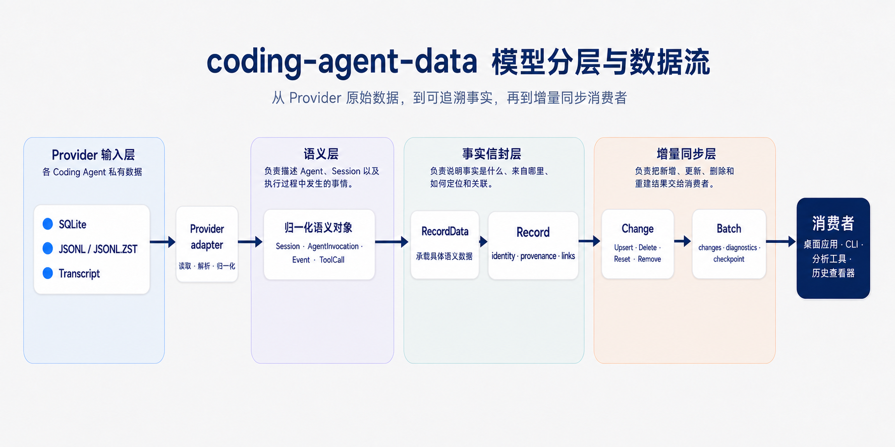

<div align="center">

<p><a href="GLOSSARY.md">English</a> | <a href="GLOSSARY_ZH.md"><strong>中文</strong></a></p>

</div>

# 名词术语

coding-agent-data 的核心模型名词表。本文集中说明每个模型的定义、边界、典型实例和主要参考来源。

## 模型分层与职责边界

这里的“层”是为了帮助读者理解模型职责的概念分类，不是 Rust 模块层级、数据库表层级，也不是对象之间的继承关系。一个对象可能作为另一个对象的字段或枚举载荷出现，但这不表示它们属于同一个层。

| 层              | 核心问题                                     | 主要类型                                                                                           | 职责与边界                                                                                                      |
| --------------- | -------------------------------------------- | -------------------------------------------------------------------------------------------------- | --------------------------------------------------------------------------------------------------------------- |
| Provider 输入层 | 原始数据在哪里，Provider 如何读取它？        | Codex、Claude Code 及其 Provider 实现                                                              | 处理本地 SQLite、JSONL、Transcript 等 Provider 私有格式。它是统一模型的输入边界，不属于跨 Provider 的业务语义。 |
| 语义层          | Agent、Session 和执行过程中究竟发生了什么？  | `Session`、`AgentInvocation`、`ModelInvocation`、`Event`、`Message`、`ToolCall`、`TaskArtifact` 等 | 描述跨 Provider 的对象和行为，例如一次 Agent 执行、一条消息或一次工具调用。                                     |
| 事实信封层      | 这条归一化事实来自哪里，如何稳定定位和关联？ | `Record`、`RecordData`                                                                             | 提供稳定 ID、来源、原始位置、关系和具体语义载荷。这一层负责事实的身份和 provenance，不新增 Agent 行为语义。     |
| 增量同步层      | Provider 如何把新增、修改和删除交给消费者？  | `Change`、`Batch`、`Checkpoint`                                                                    | 描述扫描结果和同步协议，表达新增、替换、删除、重建和续扫过程，不描述 Agent 的行为。                             |

这几层的关系可以简化为：



## 核心模型速查表

| 名称                                       | 所在层     | 定义与职责                                                                                                                                                                        | 典型关系或例子                                                                                                                |
| ------------------------------------------ | ---------- | --------------------------------------------------------------------------------------------------------------------------------------------------------------------------------- | ----------------------------------------------------------------------------------------------------------------------------- |
| [`Session`](../src/model.rs#L378)             | 语义层     | Provider 持久化的对话、线程或工作上下文。它是多个 Agent 执行共享的长期容器，通常还保存标题、工作目录、模型、Git 信息和 Token 汇总等会话级元数据。                                 | 一个 Codex Thread 可以对应一个 `Session`，其中连续发生多个 `AgentInvocation`。                                                |
| [`AgentInvocation`](../src/model.rs#L1681)    | 语义层     | Agent 接收一次输入后，完成模型调用、工具操作、消息处理以及可能的子 Agent 协作，直到进入终态或其他生命周期状态的完整执行过程。                                                     | 一次“搜索代码、修改文件、运行测试并回复用户”的全过程是一个 `AgentInvocation`，其中可以包含多个 `ModelInvocation` 和 `Event`。 |
| [`ModelInvocation`](../src/model.rs#L1365)    | 语义层     | Agent 向语言模型发起的一次具体请求及其生命周期。它是 Agent 执行中的一个子过程，可以记录模型、状态、停止原因和请求耗时等信息。                                                     | 一个 `AgentInvocation` 可能因工具调用或多轮决策而包含多个 `ModelInvocation`。                                                 |
| [`Event`](../src/model.rs#L2019)              | 语义层     | 执行过程中发生的一条有序事实。它负责携带顺序、来源 Actor、父子关系和 `EventData`，因此可以表达消息、推理、工具调用、文件变更或子 Agent 活动。                                     | “用户发送问题”“调用搜索工具”“工具返回结果”分别可以是同一个 `AgentInvocation` 中的多个 `Event`。                               |
| [`EventData`](../src/model.rs#L1957)          | 语义层     | `Event` 的具体语义载荷，表示这条事件到底发生了什么。它可以承载 `Message`、`ToolCall`、`ToolResult`、`FileChange`、`AgentInvocation`、`Plan` 等变体。                              | `Event { actor: Actor::Tool, data: EventData::ToolResult(...) }` 表示工具返回了一条结果。                                     |
| [`UsageReport`](../src/model.rs#L549)         | 语义层     | Provider 在某个时间点报告的一份用量事实。它可以同时包含模型和请求身份、累计 Token 快照、当前增量 Token、服务层级以及成本信息。它描述用量，不代表一次 Agent 执行。                 | `RecordData::UsageReport(UsageReport)` 可以被消费者用于替换会话累计值，或在归因成立时累加 `delta`。                                 |
| [`Actor`](../src/model.rs#L695)               | 语义层     | 导致或产生某条 `Event` 的主体或系统，例如用户、Agent、工具、运行环境或系统。它描述事件来源，不描述消息在对话协议中的角色。                                                        | 工具返回结果通常可以标记为 `actor: Actor::Tool`。                                                                             |
| [`MessageRole`](../src/model.rs#L772)         | 语义层     | `Message` 在对话协议中的角色，例如 `System`、`Developer`、`User`、`Assistant` 或 `Tool`。它描述消息如何被协议解释，不直接证明哪个主体执行了动作。                                 | 一条 `Message` 可以是 `role: MessageRole::Assistant`，同时外层 `Event.actor` 为 `Actor::Agent`。                              |
| [`Message`](../src/model.rs#L1033)            | 语义层     | 一条带有角色、可选展示阶段和有序内容块的对话消息。它只描述消息本身，事件顺序、Actor 和因果关系由外层 `Event` 保存。                                                               | 用户问题、Agent 的中间 commentary 和最终回答都可以归一化为 `Message`。                                                        |
| [`MessagePhase`](../src/model.rs#L802)        | 语义层     | Assistant 消息在一次执行中的展示阶段。`Commentary` 表示中间过程，`FinalAnswer` 表示当前请求的最终回答，`Other` 表示 Provider 暂时无法映射的阶段。                                 | `Message { role: Assistant, phase: FinalAnswer, ... }` 表示最终答复，不表示整个 `AgentInvocation` 已成功。                    |
| [`SessionRelationKind`](../src/model.rs#L248) | 语义层     | 当前 `Session` 与另一个 `Session` 之间的 lineage 关系。`Fork` 表示从历史分支，`Child` 表示由父 Session 中的 Agent 创建，`Continuation` 表示同一逻辑工作迁移到新的 Provider 容器。 | `S2 --Fork--> S1` 表示 S2 从 S1 的历史分支出来。                                                                              |
| [`HistoryMode`](../src/model.rs#L295)         | 语义层     | Provider 保存和拼接 Session 历史的方式。`Legacy` 通常表示 Transcript 自包含，`Paginated` 表示按逻辑 ordinal 拼接并可能引用祖先历史前缀，`Other` 保留未知模式。                    | Fork 后的 Session 可能用 `Paginated` 读取父 Session 的历史前缀，再接上自己的记录。                                            |
| [`InputQueueMutation`](../src/model.rs#L1862) | 语义层     | 对待处理用户输入队列执行的一次操作，例如入队、出队、移除或清空。它描述队列发生了什么变化，不是队列在某一时刻的完整快照。                                                          | `EventData::InputQueue(InputQueueMutation { operation: QueueOperation::Enqueue, ... })` 表示一条输入被加入待处理队列。        |
| [`TaskArtifact`](../src/model.rs#L1649)       | 语义层     | Agent 或子 Agent 在任务中产生并向外部交付的结果。它可以由文本、文件引用、结构化数据或其他 `ContentBlock` 组成，不要求一定对应一个工作区文件。                                     | 代码审查报告、补丁说明、结构化 JSON 或图片引用都可以是 `TaskArtifact`。                                                       |
| [`Record`](../src/model.rs#L2105)             | 事实信封层 | 一条带有稳定 ID、Provider 来源、原始位置、Session/Invocation 关联和语义载荷的归一化事实信封。它负责让消费者能够定位、更新、删除和追溯事实。                                       | `Record { id, source, origin, data: RecordData::Event(...) }` 表示一条可被增量同步的有来源事件事实。                          |
| [`RecordData`](../src/model.rs#L2073)         | 事实信封层 | `Record` 携带的具体事实类型。它把 Session、AgentInvocation、Event、UsageReport、RateLimit 和 Unknown 等语义对象放进统一的枚举载荷中。                                             | `RecordData::Event(Event)` 表示 Record 的语义内容是一条 Event，Record 本身仍负责 ID 和 provenance。                           |
| [`Change`](../src/model.rs#L2150)             | 增量同步层 | Provider 要求消费者对归一化事实执行的一项变更。`Upsert` 插入或替换 Record，`Delete` 删除 Record，`Reset` 重建一个来源，`Remove` 清理已经消失的来源。                              | 消费者收到 `Change::Upsert(record)` 后，按 `record.id` 写入或更新事实。                                                       |
| [`Batch`](../src/model.rs#L2299)              | 增量同步层 | Provider 一次有界 `scan` 返回的结果页。它包含按顺序排列的 `Change`、可恢复诊断、续扫 `Checkpoint` 以及 `has_more` 标志。                                                          | 消费者应用一个 `Batch` 后，先在同一事务中保存 changes 和 checkpoint，再决定是否继续扫描。                                     |
| [`Checkpoint`](../src/model.rs#L2225)         | 增量同步层 | Provider 私有的增量扫描续扫状态。消费者只负责持久化并原样传回，不应解释其中的 Provider-specific state。                                                                           | Codex 和 Claude Code 可以使用不同的 checkpoint 格式，但上层都通过同一个 `Checkpoint` 接口续扫。                               |

## 典型工作示例

用户在一个 Codex 工作线程中提出“修复登录超时并运行测试”：

| 顺序 | 模型            | 示例                       | 含义                         |
| ---- | --------------- | -------------------------- | ---------------------------- |
| 1    | Session         | S1：修复登录超时并运行测试 | 持续保存这个工作线程的上下文 |
| 2    | AgentInvocation | I1：处理本次请求           | 一次完整 Agent 执行          |
| 3    | Event           | E1：用户消息               | I1 中的一条事实              |
| 4    | Event           | E2：调用搜索工具           | EventData 类型为 ToolCall    |
| 5    | Event           | E3：搜索工具返回           | EventData 类型为 ToolResult  |
| 6    | Event           | E4：修改 auth_client.rs    | EventData 类型为 FileChange  |
| 7    | Event           | E5：调用测试工具           | EventData 类型为 ToolCall    |
| 8    | Event           | E6：测试工具返回           | EventData 类型为 ToolResult  |
| 9    | Event           | E7：返回最终消息           | EventData 类型通常为 Message |
| 10   | AgentInvocation | I2：用户后续追问           | 可以和 I1 属于同一个 Session |

逻辑关系：

```text
Session S1
├── AgentInvocation I1
│   ├── Event E1
│   ├── Event E2
│   └── ...
└── AgentInvocation I2
```

实际代码不把 Session、AgentInvocation、Event 等对象嵌套在一个大结构体中，而是由 Provider adapter 将每个可独立识别、更新或删除的事实表示为一个扁平 `Record`。`Record` 是事实 envelope，负责保存稳定身份、来源、关系和 provenance 信息，`RecordData` 是其中描述具体语义的载荷。各个 `Record` 通过 ID 建立 `session`、`invocation` 和 `parent` 等关系，不复制或嵌套完整对象。

这种扁平结构便于消费者按 Record ID 单独插入、替换或删除某一事实，而不必重写整个 Session。它也避免重复嵌套和循环引用，使事实语义与来源追溯保持清晰边界。

下面的数组展示同一工作线程中的 `S1`、`I1` 和 `E1`–`E7`。它们是相互独立的 Record，只通过 ID 关联，省略可选字段：

```json
[
    {
        "id": "codex-local:session:thread-123",
        "source": "codex-local",
        "session": null,
        "invocation": null,
        "origin": {
            "source": "codex-local",
            "path": "/data/codex/state.sqlite",
            "location": { "kind": "database_record", "key": "thread-123" }
        },
        "data": {
            "type": "session",
            "value": {
                "external_id": "thread-123",
                "title": "修复登录超时并运行测试",
                "cwd": "/workspace/app",
                "archived": false,
                "model": "gpt-5",
                "git_branch": "main",
                "quality": "partial"
            }
        }
    },
    {
        "id": "codex-local:invocation:turn-001",
        "source": "codex-local",
        "session": "codex-local:session:thread-123",
        "invocation": null,
        "origin": {
            "source": "codex-local",
            "path": "/data/codex/rollout.jsonl",
            "location": { "kind": "json_line", "line": 42 }
        },
        "data": {
            "type": "agent_invocation",
            "value": {
                "invocation_id": "turn-001",
                "operation": "invoke",
                "status": "completed"
            }
        }
    },
    {
        "id": "codex-local:event:turn-001:1",
        "source": "codex-local",
        "session": "codex-local:session:thread-123",
        "invocation": "codex-local:invocation:turn-001",
        "origin": {
            "source": "codex-local",
            "path": "/data/codex/rollout.jsonl",
            "location": { "kind": "json_line", "line": 43 }
        },
        "data": {
            "type": "event",
            "value": {
                "sequence": { "position": 1, "part": 0 },
                "parent": null,
                "actor": "user",
                "data": {
                    "type": "message",
                    "value": {
                        "role": "user",
                        "phase": null,
                        "content": [{ "type": "text", "text": "修复登录超时并运行测试" }]
                    }
                }
            }
        }
    },
    {
        "id": "codex-local:event:turn-001:2",
        "source": "codex-local",
        "session": "codex-local:session:thread-123",
        "invocation": "codex-local:invocation:turn-001",
        "origin": {
            "source": "codex-local",
            "path": "/data/codex/rollout.jsonl",
            "location": { "kind": "json_line", "line": 44 }
        },
        "data": {
            "type": "event",
            "value": {
                "sequence": { "position": 2, "part": 0 },
                "parent": "codex-local:event:turn-001:1",
                "actor": "agent",
                "data": {
                    "type": "tool_call",
                    "value": {
                        "call_id": "search-001",
                        "name": "search",
                        "namespace": null,
                        "title": "搜索登录超时相关代码",
                        "kind": "search",
                        "status": "completed",
                        "input": { "query": "login timeout", "path": "." },
                        "locations": []
                    }
                }
            }
        }
    },
    {
        "id": "codex-local:event:turn-001:3",
        "source": "codex-local",
        "session": "codex-local:session:thread-123",
        "invocation": "codex-local:invocation:turn-001",
        "origin": {
            "source": "codex-local",
            "path": "/data/codex/rollout.jsonl",
            "location": { "kind": "json_line", "line": 45 }
        },
        "data": {
            "type": "event",
            "value": {
                "sequence": { "position": 3, "part": 0 },
                "parent": "codex-local:event:turn-001:2",
                "actor": "tool",
                "data": {
                    "type": "tool_result",
                    "value": {
                        "call_id": "search-001",
                        "name": "search",
                        "output": { "matches": ["src/auth_client.rs:42"] },
                        "content": [{ "type": "text", "text": "找到 src/auth_client.rs:42" }],
                        "status": "completed",
                        "error": null,
                        "duration_ms": 120
                    }
                }
            }
        }
    },
    {
        "id": "codex-local:event:turn-001:4",
        "source": "codex-local",
        "session": "codex-local:session:thread-123",
        "invocation": "codex-local:invocation:turn-001",
        "origin": {
            "source": "codex-local",
            "path": "/data/codex/rollout.jsonl",
            "location": { "kind": "json_line", "line": 46 }
        },
        "data": {
            "type": "event",
            "value": {
                "sequence": { "position": 4, "part": 0 },
                "parent": "codex-local:event:turn-001:3",
                "actor": "agent",
                "data": {
                    "type": "file_change",
                    "value": {
                        "path": "src/auth_client.rs",
                        "old_path": null,
                        "kind": "update",
                        "diff": "- timeout = 5s\\n+ timeout = 30s",
                        "status": "completed"
                    }
                }
            }
        }
    },
    {
        "id": "codex-local:event:turn-001:5",
        "source": "codex-local",
        "session": "codex-local:session:thread-123",
        "invocation": "codex-local:invocation:turn-001",
        "origin": {
            "source": "codex-local",
            "path": "/data/codex/rollout.jsonl",
            "location": { "kind": "json_line", "line": 47 }
        },
        "data": {
            "type": "event",
            "value": {
                "sequence": { "position": 5, "part": 0 },
                "parent": "codex-local:event:turn-001:4",
                "actor": "agent",
                "data": {
                    "type": "tool_call",
                    "value": {
                        "call_id": "test-001",
                        "name": "shell",
                        "namespace": null,
                        "title": "运行测试",
                        "kind": "execute",
                        "status": "completed",
                        "input": { "command": "cargo test" },
                        "locations": []
                    }
                }
            }
        }
    },
    {
        "id": "codex-local:event:turn-001:6",
        "source": "codex-local",
        "session": "codex-local:session:thread-123",
        "invocation": "codex-local:invocation:turn-001",
        "origin": {
            "source": "codex-local",
            "path": "/data/codex/rollout.jsonl",
            "location": { "kind": "json_line", "line": 48 }
        },
        "data": {
            "type": "event",
            "value": {
                "sequence": { "position": 6, "part": 0 },
                "parent": "codex-local:event:turn-001:5",
                "actor": "tool",
                "data": {
                    "type": "tool_result",
                    "value": {
                        "call_id": "test-001",
                        "name": "shell",
                        "output": { "exit_code": 0 },
                        "content": [{ "type": "text", "text": "测试通过" }],
                        "status": "completed",
                        "error": null,
                        "duration_ms": 8400
                    }
                }
            }
        }
    },
    {
        "id": "codex-local:event:turn-001:7",
        "source": "codex-local",
        "session": "codex-local:session:thread-123",
        "invocation": "codex-local:invocation:turn-001",
        "origin": {
            "source": "codex-local",
            "path": "/data/codex/rollout.jsonl",
            "location": { "kind": "json_line", "line": 49 }
        },
        "data": {
            "type": "event",
            "value": {
                "sequence": { "position": 7, "part": 0 },
                "parent": "codex-local:event:turn-001:6",
                "actor": "agent",
                "data": {
                    "type": "message",
                    "value": {
                        "role": "assistant",
                        "phase": "final_answer",
                        "content": [{ "type": "text", "text": "已修复登录超时问题，cargo test 已通过。" }]
                    }
                }
            }
        }
    }
]
```

`RecordData` 始终序列化为 `{ "type": "...", "value": {...} }`。完整 `Record` 还可包含 `timestamp`、`origin` 和 `original` 等字段。

## 语义层模型

### Session

| 项目      | 说明                                                                                 |
| --------- | ------------------------------------------------------------------------------------ |
| Rust 类型 | [Session](../src/model.rs#L378)                                                         |
| 定义      | Provider 持久化的对话、线程、工作任务或 Transcript 上下文                            |
| 主要字段  | external_id、title、cwd、transcript、时间、model、Token 快照、Git 信息、archive 状态 |
| 可以包含  | 多个 AgentInvocation，以及这些 Invocation 产生的 Event                               |
| 典型实例  | 同一个 Codex Thread 中连续提出三个问题，三个 Invocation 共享一个 Session             |
| 不包含    | 一次执行、一次模型请求、一个目录或一条原始数据库行                                   |

参考来源：

- [Google ADK：Session — Tracking individual conversations](https://adk.dev/sessions/session/)
- [Agent Client Protocol：Session Setup](https://agentclientprotocol.com/protocol/v1/session-setup)

### SessionRelationKind、SessionRelation 与 HistoryMode

| 名词                  | 它回答的问题                                | 具体含义                                                                                                               | 示例                                                      |
| --------------------- | ------------------------------------------- | ---------------------------------------------------------------------------------------------------------------------- | --------------------------------------------------------- |
| `SessionRelationKind` | 两个 Session 是什么关系？                   | `Fork` 是从已有历史分支，`Child` 是由父 Session 中的 Agent 创建，`Continuation` 是同一逻辑工作迁移到新的 Provider 容器 | S2 从 S1 分支：`S2 -> Fork -> S1`                         |
| `SessionRelation`     | 这条关系连接了哪两个 Session？              | 用 `kind` 加目标 `session` 表达一条有方向的 lineage 边                                                                 | `Session S2` 的 `Fork(S1)`                                |
| `HistoryMode`         | Provider 如何保存和拼接历史？               | `Legacy` 是自包含 Transcript，`Paginated` 使用逻辑 ordinal 并可引用祖先历史前缀，`Other` 保留未知模式                  | Fork 后的 S2 读取 S1 的历史前缀，再接着读取 S2 自己的记录 |
| `SessionHistory`      | 一个逻辑 Session 的历史由哪些物理范围组成？ | 保存 `HistoryMode`、祖先基线、自己的起始 ordinal 和 lineage 分段                                                       | S1 的前 100 条记录 + S2 从 ordinal 100 开始的记录         |

关系方向始终是“当前 Session → 被引用的 Session”。例如：

```text
S2 --Fork--------> S1   S2 的历史从 S1 分支
S3 --Child-------> S1   S3 是 S1 中 Agent 创建的子 Session
S4 --Continuation-> S1   S4 延续 S1 的逻辑工作
```

参考来源：

- [OpenAI Codex：Thread lineage fields](https://github.com/openai/codex/blob/main/codex-rs/app-server-protocol/src/protocol/v2/thread.rs)
- [OpenAI Codex：ThreadHistoryMode](https://github.com/openai/codex/blob/main/codex-rs/app-server-protocol/src/protocol/v2/thread_data.rs)

### AgentInvocation

| 项目          | 说明                                                                                                            |
| ------------- | --------------------------------------------------------------------------------------------------------------- |
| Rust 类型     | [AgentInvocation](../src/model.rs#L1681)                                                                           |
| 定义          | Agent 接收一次输入后，完成模型调用、工具操作、消息处理和可能的子 Agent 协作，直到进入某个生命周期状态的完整过程 |
| 可以包含      | 多个 ModelInvocation、ToolCall、ToolResult、Message、FileChange 和 TaskArtifact                                 |
| 顶层承载      | RecordData::AgentInvocation                                                                                     |
| 子 Agent 承载 | EventData::AgentInvocation                                                                                      |
| 典型实例      | 搜索代码、修改文件、运行测试并返回结果的整个过程                                                                |
| 不包含        | Session、单次模型请求、单次工具调用或单条 Event                                                                 |

不同系统中的相近名称：

| 系统或协议         | 名称       | 与本模型的关系                                                                  |
| ------------------ | ---------- | ------------------------------------------------------------------------------- |
| Google ADK         | Invocation | 一次请求引发的完整处理过程，可包含多个 Agent run、模型调用、工具调用和 callback |
| Codex              | Turn       | Provider-native 执行单元；原始 turn_id 等字段继续保留                           |
| 其他 Agent runtime | Run        | 常见叫法，但不同 runtime 的边界可能不同                                         |
| A2A                | Task       | 有状态且具有生命周期的 Agent 工作单元，语义相近但不是本 crate 的协议对象        |

本 crate 使用 AgentInvocation，是为了明确它表示 Agent 层执行，并与 ModelInvocation、Tool invocation 区分开。

参考来源：

- [Google ADK：Runtime Event Loop — Invocation](https://adk.dev/runtime/event-loop/#invocation)
- [OpenAI Codex：Turn protocol](https://github.com/openai/codex/blob/main/codex-rs/app-server-protocol/src/protocol/v2/turn.rs)
- [A2A：Key Concepts — Task](https://a2a-protocol.org/latest/topics/key-concepts/#task)
- [A2A：Life of a Task](https://a2a-protocol.org/latest/topics/life-of-a-task/)

### Event 与 EventData

| 项目       | Event                                                          | EventData                                                                |
| ---------- | -------------------------------------------------------------- | ------------------------------------------------------------------------ |
| Rust 类型  | [Event](../src/model.rs#L2019)                                    | [EventData](../src/model.rs#L1957)                                          |
| 角色       | 事件信封                                                       | 事件载荷                                                                 |
| 负责内容   | external_id、sequence、parent、inherited_from、actor、agent_id | Message、Reasoning、ToolCall、ToolResult、FileChange、AgentInvocation 等 |
| 回答的问题 | 什么时候发生、由谁产生、和什么有关                             | 具体发生了什么                                                           |

EventData 常见变体：

| 变体                           | 含义                       | 示例                       |
| ------------------------------ | -------------------------- | -------------------------- |
| Message                        | 对话消息                   | 用户问题、Agent 最终回答   |
| Reasoning                      | Provider 暴露的推理摘要    | Agent 思考摘要             |
| ToolCall                       | 工具调用请求或开始         | 请求执行 shell 或读取文件  |
| ToolResult                     | 工具调用结果               | 命令输出或搜索结果         |
| FileChange                     | 文件系统变更               | 创建、修改、删除或移动文件 |
| ModelInvocation                | 一次语言模型请求           | 一次发给 LLM 的请求        |
| AgentInvocation                | 子 Agent 或协作 Agent 执行 | 委派代码审查               |
| Plan                           | Agent 计划及其步骤         | 待办步骤和完成状态         |
| ContextCompaction              | 上下文压缩                 | Transcript 被压缩为摘要    |
| InputQueue(InputQueueMutation) | 待处理用户输入队列变更     | 入队、出队或移除一条输入   |
| Unknown                        | 尚未归一化的 Provider 事件 | 保留类型名和未知内容       |

典型结构：

```text
Event
├── sequence: EventSequence
├── actor: Actor
└── data: EventData::ToolCall
```

参考来源：

- [Google ADK：Events](https://adk.dev/events/)
- [Google ADK：Runtime Event Loop](https://adk.dev/runtime/event-loop/)

### UsageReport、TokenUsage、Cost 与 RateLimit

| 名词          | 定义                                                                                  | 主要字段                                             |
| ------------- | ------------------------------------------------------------------------------------- | ---------------------------------------------------- |
| `UsageReport` | Provider 在某个时间点报告的一次用量事实，可携带模型和请求身份、累计快照、增量以及成本 | model、request_id、`cumulative`、`delta`、cost       |
| `TokenUsage`  | 一组可单独统计的 Token 计数，用于表示累计快照或当前报告产生的增量                     | input、cached_input、output、reasoning_output、total |
| `Cost`        | Provider 报告的金额和货币信息，金额以文本保存以避免二进制浮点数引入误差               | amount、currency                                     |
| `RateLimit`   | Provider 在某个时间点报告的限流窗口、额度、消费和触发原因快照                         | windows、credits、spend_limit、reached_reason        |

`UsageReport` 是外层用量报告，`TokenUsage` 是其中的计数值。例如同一条 Record 可以同时携带模型名称、请求 ID、累计 Token、当前增量 Token 和金额。累计值由消费者替换保存；只有在归因规则确认可加总时，才聚合 `delta`。

参考来源：

- [Anthropic Messages API：usage fields](https://platform.claude.com/docs/en/api/messages)
- [OpenAI Codex：thread token usage model](https://github.com/openai/codex/blob/main/codex-rs/protocol/src/models.rs)

### Actor、MessageRole、Message、MessagePhase

这几个名词位于不同层次，最重要的区别是：`Actor` 描述事件由谁或什么产生，`MessageRole` 描述消息在对话协议中的角色。

| 类型            | 它回答的问题                        | 它描述什么                                                                                    | 示例                                                                 |
| --------------- | ----------------------------------- | --------------------------------------------------------------------------------------------- | -------------------------------------------------------------------- |
| `Actor`         | 谁或什么导致了这条 Event？          | Event envelope 上的来源：`User`、`Agent`、`System`、`Environment`、`Tool`                     | 工具返回结果：`Actor::Tool`                                          |
| `MessageRole`   | 这条 Message 在对话中扮演什么角色？ | Message payload 的角色：`System`、`Developer`、`User`、`Assistant`、`Tool`                    | 工具结果被 Provider 编码为消息时，可能是 `Tool`，也可能保留为 `User` |
| `Message`       | 这条对话消息包含什么？              | `role`、可选的 `phase` 和有序 `ContentBlock`                                                  | 用户问题、Agent 的 commentary、最终回答                              |
| `MessagePhase`  | Assistant 消息处于哪个展示阶段？    | `Commentary` 表示中间过程，`FinalAnswer` 表示当前请求的最终回答，`Other` 表示未知 Provider 值 | `role = Assistant, phase = FinalAnswer`                              |
| `EventSequence` | 同一来源中的 Event 如何排序？       | Provider/artifact 位置、同位置内的派生部分顺序，以及可选逻辑 ordinal                          | 一条原始记录拆成多个 Event 时用 `part` 排序                          |

一个“工具返回结果”的归一化例子：

```text
Event
├── actor: Actor::Tool
└── data: EventData::Message(
        Message {
            role: MessageRole::Tool,
            phase: None,
            content: [Text("测试命令输出")]
        }
    )
```

一个“Agent 最终回答”的归一化例子：

```text
Event
├── actor: Actor::Agent
└── data: EventData::Message(
        Message {
            role: MessageRole::Assistant,
            phase: Some(MessagePhase::FinalAnswer),
            content: [Text("登录超时已修复，测试通过")]
        }
    )
```

字段边界：

| 类型           | 主要字段             | 归一化规则                                                       |
| -------------- | -------------------- | ---------------------------------------------------------------- |
| `Actor`        | Event.actor          | 表示观察到这条 Event 的生产者；Provider 没有对应值时保留 `Other` |
| `MessageRole`  | Message.role         | 表示对话协议角色；不能据此推断 Agent 是否真的执行了动作          |
| `Message`      | role、phase、content | 只表达消息内容；sequence、actor、parent 等信息由外层 Event 保存  |
| `MessagePhase` | Message.phase        | Provider 未报告时为 `None`；`None` 不是 `FinalAnswer` 的同义词   |

参考来源：

- `Actor` 的语义类比 [Google ADK：Identifying event origin and type](https://adk.dev/events/#identifying-event-origin-and-type)
- `MessageRole` 的角色类比 [Anthropic：Messages API](https://platform.claude.com/docs/en/api/messages)
- `Message` 的事件和消息模型类比 [Google ADK：Events](https://adk.dev/events/)
- `MessagePhase` 的直接 Provider 参考 [OpenAI Codex：MessagePhase](https://github.com/openai/codex/blob/main/codex-rs/protocol/src/models.rs)

### TaskArtifact

| 项目      | 说明                                                        |
| --------- | ----------------------------------------------------------- |
| Rust 类型 | [TaskArtifact](../src/model.rs#L1649)                          |
| 定义      | Agent 或子 Agent 在任务中产生并返回的交付物                 |
| 主要字段  | artifact_id、name、description、parts、metadata             |
| parts     | 按顺序排列的 ContentBlock，可包含文本、文件引用或结构化内容 |
| 典型实例  | 代码审查报告、补丁说明、结构化 JSON、图片或文件引用         |
| 不包含    | 工作区文件变更本身，也不一定是文件                          |

与 FileChange 的区别：

| 模型         | 表达什么                         | 示例                |
| ------------ | -------------------------------- | ------------------- |
| FileChange   | Agent 对工作区执行的文件系统变更 | 修改 auth_client.rs |
| TaskArtifact | Agent 任务对外返回的交付物       | 返回安全审查报告    |

参考来源：

- [A2A：Key Concepts — Artifact](https://a2a-protocol.org/latest/topics/key-concepts/#artifacts)
- [A2A：Life of a Task](https://a2a-protocol.org/latest/topics/life-of-a-task/)

## 事实信封层

### Record 与 RecordData

| 项目       | Record                                                       | RecordData                                                       |
| ---------- | ------------------------------------------------------------ | ---------------------------------------------------------------- |
| Rust 类型  | [Record](../src/model.rs#L2105)                                 | [RecordData](../src/model.rs#L2073)                                 |
| 角色       | Provider-neutral 事实信封                                    | 事实的具体语义载荷                                               |
| 负责内容   | id、source、session、invocation、timestamp、origin、original | Session、AgentInvocation、Event、UsageReport、RateLimit、Unknown |
| 解决的问题 | 事实来自哪里、如何定位、属于谁、如何更新或删除               | 事实表达了什么                                                   |

RecordData 变体：

| 变体                             | 表达的内容              | 典型用法                     |
| -------------------------------- | ----------------------- | ---------------------------- |
| Session(Session)                 | Session 元数据或快照    | 更新标题、工作目录或模型     |
| AgentInvocation(AgentInvocation) | 一次完整 Agent 执行     | 更新状态和耗时               |
| Event(Event)                     | 一条有序执行事实        | 保存消息、工具调用或文件变更 |
| UsageReport(UsageReport)        | Token 使用或成本报告    | 更新累计 Token 或记录增量    |
| RateLimit(RateLimit)             | Provider 限流和额度快照 | 展示剩余额度或限制原因       |
| Unknown(UnknownRecord)           | 尚未归一化的数据        | 避免静默丢失 Provider 信息   |

一条工具调用事件的 Record 可以抽象为：

```text
Record
├── id: codex:event:...
├── source: codex-local
├── session: session:S1
├── invocation: invocation:I1
├── origin: rollout.jsonl:line 42
└── data: RecordData::Event(Event {
        data: EventData::ToolCall(...)
    })
```

Record 与 RecordData 不能简单合并，因为同一种语义载荷仍需要统一的来源、稳定 ID、原始位置和关联关系；增量消费者也需要通过 Record::id 更新或删除事实。Record::original 用于 provenance 和诊断，保留 Provider 原始值，不代表兼容层。

外部类比：[Apache Kafka Connect SourceRecord](https://kafka.apache.org/40/javadoc/org/apache/kafka/connect/source/SourceRecord.html)。该类比只说明“来源身份 + 原始位置/游标 + 载荷”的数据集成边界，Record 不是 Kafka 类型的直接复用。

## 增量同步层

### Change

| 变体              | 含义                       | 消费者动作                 |
| ----------------- | -------------------------- | -------------------------- |
| Upsert(Record)    | 插入或替换一条 Record      | 按 Record::id 写入或更新   |
| Delete(RecordId)  | 删除一条已知 Record        | 删除对应归一化事实         |
| Reset(SourceRef)  | 一个 artifact 需要重新构建 | 重建该 artifact 产生的事实 |
| Remove(SourceRef) | 一个 artifact 已经消失     | 清理该 artifact 产生的事实 |

Rust 类型：[Change](../src/model.rs#L2150)。Change 是同步协议，不是 Agent 执行事件。

### Batch

| 项目        | 说明                              |
| ----------- | --------------------------------- |
| Rust 类型   | [Batch](../src/model.rs#L2299)       |
| 定义        | Provider 一次 scan 返回的有界结果 |
| changes     | 按源顺序排列的 Change             |
| checkpoint  | 应用 changes 后可以保存的续扫游标 |
| diagnostics | 扫描期间遇到的可恢复问题          |
| has_more    | 是否需要继续调用 scan             |

推荐应用顺序：

```text
读取 Batch → 应用 Batch.changes → 保存 Batch.checkpoint → 提交事务
has_more 为 true 时，再用 checkpoint 调用 scan
```

### Checkpoint

| 项目       | 说明                                                      |
| ---------- | --------------------------------------------------------- |
| Rust 类型  | [Checkpoint](../src/model.rs#L2225)                          |
| 定义       | Provider 私有的增量扫描续扫游标                           |
| 绑定范围   | 创建它的 Provider 和具体 SourceId                         |
| 消费者行为 | 持久化并原样传回，不解释内部 state                        |
| 失效处理   | Provider 或 Source 不匹配、状态无法解码时，丢弃并重新扫描 |
| 不包含     | AgentInvocation 的执行状态                                |

## 主要参考来源

| 主题                          | 来源                                                                                                                                                                                                                                                                                                                                                                                                                                                  |
| ----------------------------- | ----------------------------------------------------------------------------------------------------------------------------------------------------------------------------------------------------------------------------------------------------------------------------------------------------------------------------------------------------------------------------------------------------------------------------------------------------- |
| Session                       | [Google ADK Session](https://adk.dev/sessions/session/)、[ACP Session Setup](https://agentclientprotocol.com/protocol/v1/session-setup)                                                                                                                                                                                                                                                                                                               |
| Session lineage / history     | [Codex Thread](https://github.com/openai/codex/blob/main/codex-rs/app-server-protocol/src/protocol/v2/thread.rs)、[Codex ThreadHistoryMode](https://github.com/openai/codex/blob/main/codex-rs/app-server-protocol/src/protocol/v2/thread_data.rs)                                                                                                                                                                                                    |
| Event                         | [Google ADK Events](https://adk.dev/events/)、[Google ADK Runtime Event Loop](https://adk.dev/runtime/event-loop/)                                                                                                                                                                                                                                                                                                                                    |
| Actor / MessageRole / Message | [Google ADK Event origin and type](https://adk.dev/events/#identifying-event-origin-and-type)、[Anthropic Messages API](https://platform.claude.com/docs/en/api/messages)                                                                                                                                                                                                                                                                             |
| UsageReport / TokenUsage      | [Anthropic Messages API usage fields](https://platform.claude.com/docs/en/api/messages)、[Codex token usage model](https://github.com/openai/codex/blob/main/codex-rs/protocol/src/models.rs)                                                                                                                                                                                                                                                         |
| MessagePhase                  | [OpenAI Codex MessagePhase](https://github.com/openai/codex/blob/main/codex-rs/protocol/src/models.rs)                                                                                                                                                                                                                                                                                                                                                |
| Invocation                    | [Google ADK Invocation](https://adk.dev/runtime/event-loop/#invocation)                                                                                                                                                                                                                                                                                                                                                                               |
| Task / Artifact               | [A2A Key Concepts](https://a2a-protocol.org/latest/topics/key-concepts/)、[A2A Life of a Task](https://a2a-protocol.org/latest/topics/life-of-a-task/)                                                                                                                                                                                                                                                                                                |
| Codex 原生术语                | [Thread](https://github.com/openai/codex/blob/main/codex-rs/app-server-protocol/src/protocol/v2/thread.rs)、[Turn](https://github.com/openai/codex/blob/main/codex-rs/app-server-protocol/src/protocol/v2/turn.rs)、[Thread/Turn data](https://github.com/openai/codex/blob/main/codex-rs/app-server-protocol/src/protocol/v2/thread_data.rs)、[Item](https://github.com/openai/codex/blob/main/codex-rs/app-server-protocol/src/protocol/v2/item.rs) |
| Record 的数据集成类比         | [Kafka Connect SourceRecord](https://kafka.apache.org/40/javadoc/org/apache/kafka/connect/source/SourceRecord.html)                                                                                                                                                                                                                                                                                                                                   |

## 命名原则

命名优先复用生态中已经稳定、可理解的术语，例如 `Session`、`Event`、`Invocation` 和 `Artifact`。对于容易混淆的对象，命名还应明确反映对象的层次和行为边界。比如，`AgentInvocation` 表示一次 Agent 执行，`ModelInvocation` 表示一次模型请求，命名上能进行明确区分。Provider 的差异继续保留在 Provider 适配层和原始数据中，例如 Codex 的 `Turn`、`Item` 等术语不强行推广为统一模型名称。

模型还明确区分事实与信封，以及语义与同步协议。`Record` 负责承载事实的来源、ID、位置和关系，`RecordData` 负责表达具体语义。`Change`、`Batch` 和 `Checkpoint` 负责描述事实如何传递、更新和续扫，它们属于数据同步协议，不应被理解为 Agent 的行为对象。
